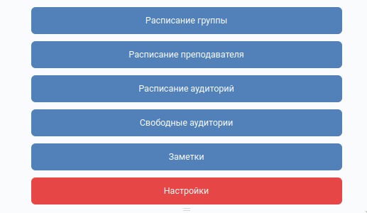

# vk-bot-agu

**README Sections:** [Установка](#nstall) - [Запуск](#run) - and - and 
	

<a id="install">
<h1>Установка</h1>
</a>

### Arch Linux
Арч выпускается по системе rolling-release, как следствие некоторые пакеты имеют приставку beta, но в этом нет абсолютно ничего страшного. Проверено и протестированно(18.11.2021).

Сперва установим chromedriver и phantomjs:

	yay chromedriver-beta phantomjs
Далее необходимо прописать путь chromedriver и phantomjs в **image_push.py** с помощью следующих команд можно определить путь:

	whereis chromedriver
	whereis phantomjs
	
Выполним установку всех зависимостей python(рекомендуется созадать env):

	pip3 install -r requirements.txt
	
<a id="run">
<h1>Запуск</h1>
</a>
Запуск производится следующим образом:

	python server.py
